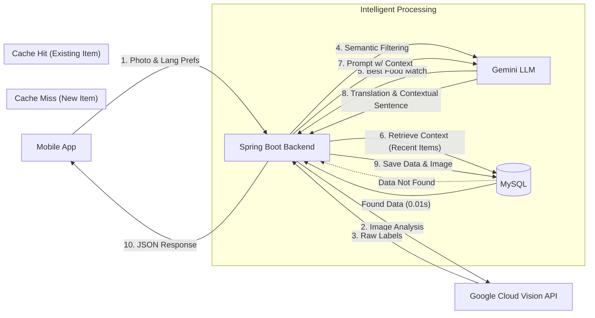

# 🍎 What's in My Refrigerator? - AI Language Learning App

> **A context-aware language learning application that turns everyday objects into micro-learning opportunities.**

This project transforms your refrigerator inventory into personalized language learning content. By leveraging **Computer Vision** to identify objects and **Generative AI (LLM)** to create context-specific sentences, it bridges the gap between the physical world and language education.

It features an **On-demand Caching System** to optimize performance and a **Gamified Spaced Repetition System** to encourage retention.

---

## 🏗️ System Architecture

The core strength of this project is its **Hybrid AI Architecture** combined with a smart caching strategy.


## 🔑 Key Technical Features

### 1. 🧠 AI-Driven Logic

- **Visual Recognition**: Uses Google Cloud Vision API to detect objects from raw camera images.

- **Semantic Filtering**: Instead of relying on hardcoded blocklists, the system uses Gemini LLM to intelligently parse Vision API labels and select the most specific food ingredient (e.g., filtering out "Produce" to find "Apple").

- **Context-Aware Generation**: The system remembers items previously scanned (e.g., Milk). When a new item is scanned (e.g., Cookie), the LLM generates a sentence combining them (e.g., "I eat cookies with milk").

### 2. ⚡ Performance & Efficiency

- **On-demand Caching Strategy**: Implements a "Check-DB-First" logic.
  - **Cache Miss**: Calls the expensive LLM API only when a new word is encountered.
  - **Cache Hit**: Returns data immediately from MySQL for previously scanned items, ensuring low latency (~15ms).

- **User Content Hosting**: User-captured photos are saved locally on the server and served back to the app, creating a personalized inventory experience.

### 3. 🎮 Gamified Learning (Spaced Repetition)

- **Freshness System**: Items in the fridge have a "Freshness" state based on the Forgetting Curve:
  - 🌿 **FRESH**: Reviewed recently.
  - ⚠️ **SOON**: Needs review (3 days).
  - 💩 **ROTTEN**: Neglected (5+ days, flies appear in UI).

- **Review Mechanism**: Users must review "Rotten" items to restore their freshness and earn XP.

### 4. 🗣️ Interactive UX

- **Text-to-Speech (TTS)**: Integrated audio playback for both words and sentences using expo-speech.

- **Native Language Support**: Supports dual-language learning (e.g., Korean user learning English) by providing definitions in the user's native tongue.

---

## 🛠️ Technology Stack

### Frontend (Mobile)
- **Framework**: React Native (Expo)
- **Language**: TypeScript
- **Network**: Axios
- **UI Components**: react-native-safe-area-context, Custom Modals, Animated API
- **Features**: Expo Camera, Expo Speech (TTS)

### Backend (Server)
- **Framework**: Spring Boot 3.2.0
- **Language**: Java 17
- **Database**: MySQL (JPA/Hibernate)
- **Build Tool**: Gradle
- **Static Serving**: WebMvcConfigurer for serving user images.
- **AI Clients**: Google Cloud Vision SDK, Spring REST Client (for Gemini)

### AI & Cloud Services
- **Google Cloud Vision API**: Object detection.
- **Google Gemini API (1.5 Flash / Pro)**: Semantic filtering, translation, and natural language generation.

---

## 🗂️ Database Architecture

The application uses a relational database design normalized to handle multilingual data and tracking logic efficiently.

```mermaid
erDiagram
    WORD {
        bigint word_id PK "Primary Key"
        varchar label_en "English Label (Vision API)"
        varchar name_ko "Native Definition"
        varchar image_path "User Image File Path"
        datetime created_at
        datetime updated_at
    }

    TRANSLATION {
        bigint translation_id PK
        bigint word_id FK "Foreign Key -> WORD"
        varchar language_code "Target Lang (es, fr, etc.)"
        varchar translated_word "Translated Text"
        varchar example_sentence "Context-Aware Sentence"
        varchar emoji "Visual Representation"
    }

    LEARNING_PROGRESS {
        bigint progress_id PK
        bigint word_id FK "Foreign Key -> WORD"
        int proficiency_level "Gamification Level (1-5)"
        int review_count "Total Reviews"
        datetime last_reviewed_at "Tracks Freshness State"
        datetime next_review_date "Calculated via SRS Algorithm"
    }

    %% Relationships
    WORD ||--o{ TRANSLATION : "1:N (Supports Multi-Language)"
    WORD ||--|| LEARNING_PROGRESS : "1:1 (Tracks User Progress)"

---

## 🚀 Getting Started

### 1. Prerequisites
- Node.js & npm
- Java JDK 17
- MySQL Server
- Google Cloud Platform Account (with Vision API enabled)
- Google AI Studio API Key (for Gemini)

### 2. Database Setup
Create a local MySQL database and the necessary tables. (The application will auto-generate tables via JPA, but ensure the DB exists).
```sql
CREATE DATABASE my_fridge_db;
```

### 3. Backend Setup
Navigate to the backend directory:
```bash
cd backend
```

**Configuration**: Add your GCP Service Account Key (`gcp-key.json`) to `src/main/resources/`. Update `src/main/resources/application.properties`:
```properties
# MySQL Configuration
spring.datasource.url=jdbc:mysql://localhost:3306/my_fridge_db?serverTimezone=UTC&characterEncoding=UTF-8
spring.datasource.username=root
spring.datasource.password=YOUR_DB_PASSWORD
spring.datasource.driver-class-name=com.mysql.cj.jdbc.Driver

# JPA
spring.jpa.hibernate.ddl-auto=update
spring.jpa.show-sql=true
spring.jpa.database-platform=org.hibernate.dialect.MySQL8Dialect

# Google Cloud Vision
spring.cloud.gcp.credentials.location=classpath:gcp-key.json

# Google Gemini
gemini.api.key=YOUR_GEMINI_API_KEY
gemini.api.url=https://generativelanguage.googleapis.com/v1beta/models/gemini-pro-latest:generateContent
```

Create the uploads directory and run:
```bash
mkdir uploads
./gradlew bootRun
```

### 4. Frontend Setup
Navigate to the frontend directory:
```bash
cd frontend
```

Install dependencies:
```bash
npm install
```

Update the API URL in `app/(tabs)/index.tsx` AND `app/(tabs)/fridge.tsx`:
```javascript
// ⚠️ Replace with your computer's local IP address (e.g., 192.168.x.x)
// Do NOT use 'localhost' if testing on a real device.
const BACKEND_URL = 'http://YOUR_LOCAL_IP:8080/api/quiz/generate';
```

Run the app:
```bash
npx expo start
```

---

## 📱 Usage Flow

1. **Setup**: Choose your Native Language and Target Language (e.g., Korean -> English).

2. **Scan**: Take a photo of a food item. The app filters noise and identifies the ingredient.

3. **Learn**: View the flashcard with the translated word and a context-aware sentence.

4. **My Fridge**: Go to the "My Fridge" tab to see your inventory.

5. **Review**: Check items marked as ROTTEN (with flies 🪰). Tap to review and restore their freshness!

---

## 🔮 Future Improvements

- **Recipe Generation**: Use the collected inventory to generate actual cooking recipes via LLM.

- **Social Leaderboard**: Compete with friends based on "Freshness Score" and XP.

- **Nutritional Analysis**: Ask Gemini to provide nutritional facts along with language learning data.

---

## 📄 License

This project is licensed under the MIT License.
